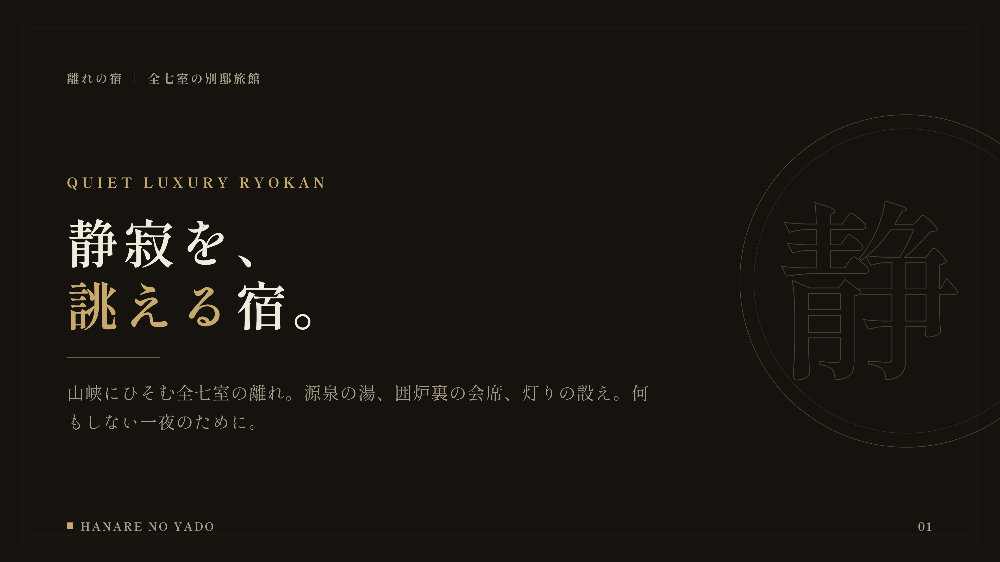
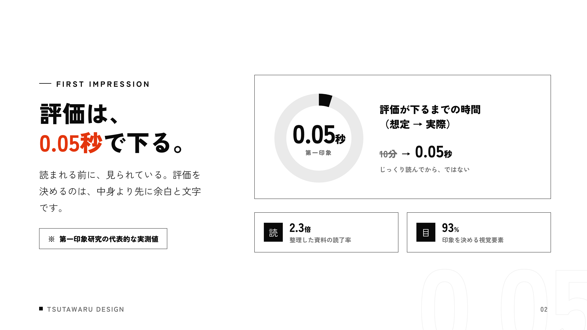
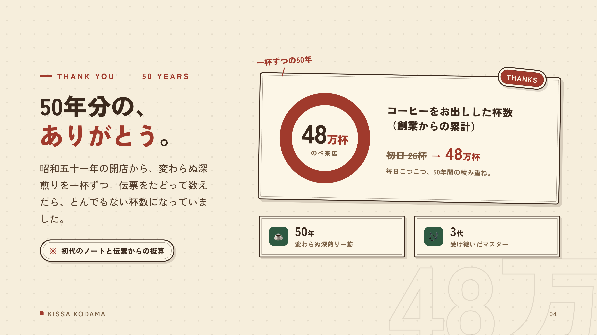
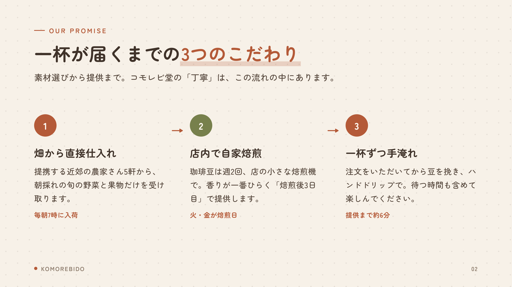
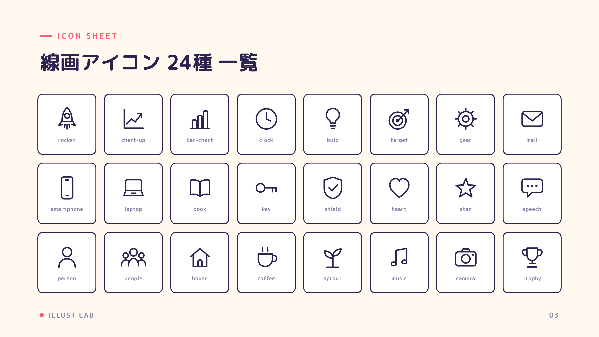

# SlideSmith 🔨✨

**テキストを渡すだけで、プロ品質の16:9スライドを量産できる Claude Code スキル**

台本（txt・メモ・箇条書き）を渡すと、Claude Code がレイアウトを選んで文章を流し込み、
4K解像度の PNG / PDF に書き出します。デザインは CSS に完全固定されているので、
**何十枚作っても同じ世界観・毎回崩れない**のが特徴です。

- 🎨 **8つのデザインテーマ内蔵**（ビジネス / ポップ / 高級 / ミニマル / テック / ナチュラル / フェミニン / レトロ）
- ♾️ **新テーマを自作できるレシピ付き**（`themes/THEME_GUIDE.md`）— どんな世界観にも対応
- 🧱 **20種のレイアウト部品** — 基本12種（表紙 / 目次 / 章扉 / カード / リスト / 比較 / 手順 / 数字 / 引用 / 画像 / 表 / 締め）＋ リッチ図解5種（ヒーロー数字 / タイムライン / ファネル / 2×2マトリクス / 横棒比較）＋ 演出3種（全面写真×斜め帯 / 円から飛び出すビジュアル / 斜め文字ステートメント）
- 🏔 **レイヤーシステム** — 紙テクスチャ×透かしタイポ×前景注釈で「奥行き」を標準装備。多層シャドウ・傾き・ポラロイド枠の立体感ユーティリティ付き
- 📷 **AI写真生成を内蔵** — Gemini APIと連携（セットアップ半自動）。テーマ別の画風レシピで世界観に合う写真を1枚約6円で生成。キーがなくても全機能成立
- ✏️ **手描き風イラスト30種** — 線画アイコン24種＋スポットイラスト6種を同梱。コピペで使えてテーマ色が自動で乗る
- ✅ **自動QC** — 文字のはみ出し・あふれを機械検査してから納品
- 💰 **基本費用ゼロ** — Claude Code の契約だけで動く（AI写真生成のみ任意の従量課金）

## ギャラリー

すべて「台本テキストを流し込んだだけ」の自動生成です。

| pop（ポップ） | tech（テックダーク） |
|---|---|
|  |  |

| corporate（ビジネス） | elegant（高級和モダン） |
|---|---|
|  |  |

| minimal（ミニマル） | retro（純喫茶レトロ） |
|---|---|
|  |  |

| warm（ナチュラル） | feminine（大人可愛い） |
|---|---|
|  |  |

**Phase 3 — 飛び出す立体感・斜め文字・イラスト:**

| breakout（飛び出すビジュアル） | kinetic（斜め文字） |
|---|---|
|  |  |



`examples/` に8テーマ×サンプルデッキ（計47枚）入り。クローンして自分でレンダリングできます。

## 必要なもの

- [Claude Code](https://claude.com/claude-code)
- Node.js 18+
- Google Chrome（レンダリングに使用）

## インストール

```bash
# Claude Code のスキルとしてインストール
git clone https://github.com/Icchaso/slidesmith.git ~/.claude/skills/slidesmith
cd ~/.claude/skills/slidesmith
npm install
```

## 使い方

Claude Code で話しかけるだけ:

```
スライド作って。テーマはポップで。台本はこれ↓
（台本テキストを貼り付け or ファイルパスを渡す）
```

Claude が台本を分割 → レイアウト割り当て → HTML生成 → PNG/PDF書き出し → 自動QC → 目視確認まで行います。

手動レンダリングも可能:

```bash
node scripts/render.mjs examples/pop-sns          # PNG書き出し + QC
node scripts/render.mjs examples/pop-sns --pdf    # PDF も生成
```

## 仕組み（なぜ崩れないのか）

```
┌─────────────────────────────────────────────┐
│  core/base.css   … 12レイアウトの骨格（固定）│
│  themes/*.css    … 色・フォント・装飾（固定）│
│  ← AI はここに一切触らない                    │
├─────────────────────────────────────────────┤
│  AI の仕事 = 台本を読み、レイアウトを選び、  │
│              文章を流し込むだけ               │
├─────────────────────────────────────────────┤
│  scripts/render.mjs … 4K PNG/PDF 書き出し    │
│                       + はみ出し自動検査      │
└─────────────────────────────────────────────┘
```

AI に毎回レイアウトを即興させると「AIっぽいダサさ」と「修正ループ」が生まれます。
SlideSmith はデザインを完全に固定し、AI の裁量を「内容の流し込み」に限定することで、
再現性とプロ品質を両立しています。

## ディレクトリ構成

```
slidesmith/
├── SKILL.md               # Claude Code が読むスキル定義
├── core/
│   ├── base.css           # 全レイアウトの骨格（編集禁止）
│   └── layouts.md         # レイアウトカタログ17種＋プロ級の鉄則
├── themes/
│   ├── THEME_GUIDE.md     # 新テーマ自作レシピ
│   ├── corporate.css      # ビジネス・信頼感
│   ├── pop.css            # ポップ・ビビッド
│   ├── elegant.css        # 高級・和モダン
│   ├── minimal.css        # ミニマル・モノクロ
│   ├── tech.css           # テック・ネオン
│   ├── warm.css           # ナチュラル・オーガニック
│   ├── feminine.css       # フェミニン
│   └── retro.css          # レトロポップ
├── scripts/
│   └── render.mjs         # レンダラー + 自動QC
├── examples/              # テーマ別サンプルデッキ
└── decks/                 # あなたのスライドはここに生成される
```

## ライセンス

MIT — 商用利用・改変・再配布自由。

## クレジット

Built with [Claude Code](https://claude.com/claude-code).
フォントは [Google Fonts](https://fonts.google.com/)（各フォントのライセンスに従います）。
