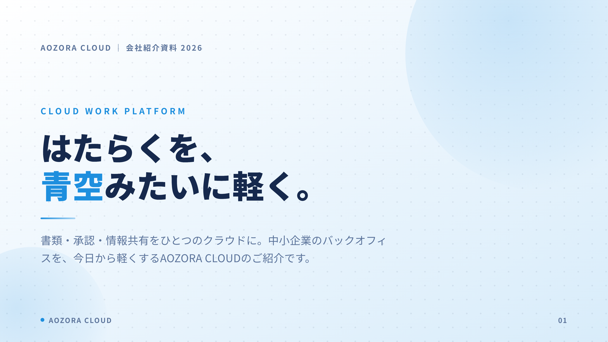
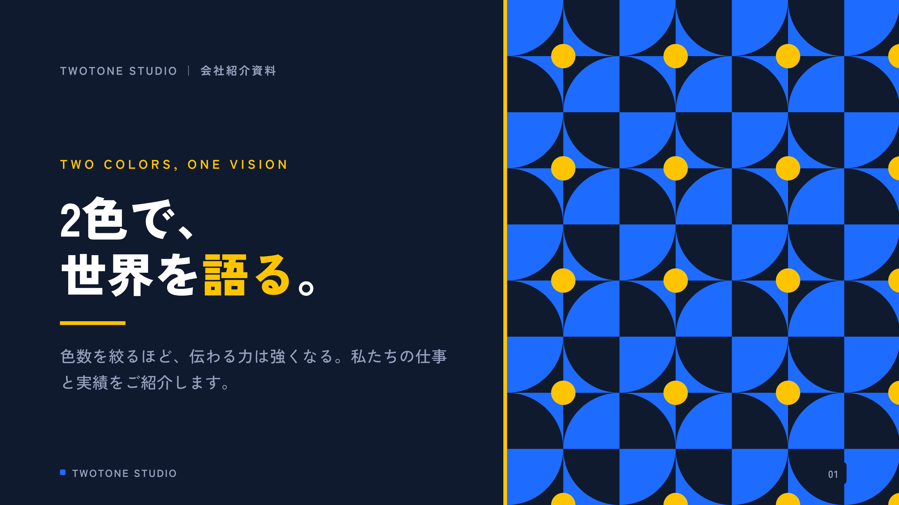
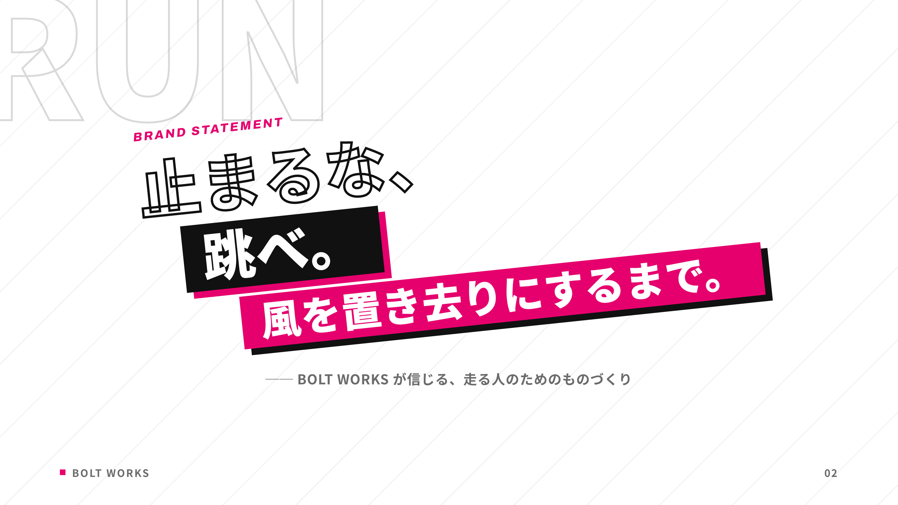

# SlideSmith 🔨✨

**テキストを渡すだけで、プロ品質の16:9スライドを量産できる Claude Code スキル**

台本（txt・メモ・箇条書き）を渡すと、Claude Code がレイアウトを選んで文章を流し込み、
4K解像度の PNG / PDF に書き出します。デザインは CSS に完全固定されているので、
**何十枚作っても同じ世界観・毎回崩れない**のが特徴です。

- 🎨 **11のデザインテーマ内蔵**（ビジネス / ポップ / 高級 / ミニマル / テック / ナチュラル / フェミニン / レトロ / 爽やか / ダイナミック / ツートン）
- ♾️ **新テーマを自作できるレシピ付き**（`themes/THEME_GUIDE.md`）— どんな世界観にも対応
- 🧱 **20種のレイアウト部品** — 基本12種（表紙 / 目次 / 章扉 / カード / リスト / 比較 / 手順 / 数字 / 引用 / 画像 / 表 / 締め）＋ リッチ図解5種（ヒーロー数字 / タイムライン / ファネル / 2×2マトリクス / 横棒比較）＋ 演出3種（全面写真×斜め帯 / 円から飛び出すビジュアル / 斜め文字ステートメント）
- 🏔 **レイヤーシステム** — 紙テクスチャ×透かしタイポ×前景注釈で「奥行き」を標準装備。多層シャドウ・傾き・ポラロイド枠の立体感ユーティリティ付き
- 📷 **AI写真生成を内蔵** — Gemini APIと連携（セットアップ半自動）。テーマ別の画風レシピで世界観に合う写真を1枚約6円で生成。キーがなくても全機能成立
- ✏️ **手描き風イラスト30種** — 線画アイコン24種＋スポットイラスト6種を同梱。コピペで使えてテーマ色が自動で乗る
- ✅ **自動QC** — 文字のはみ出し・あふれを機械検査してから納品
- 💰 **基本費用ゼロ** — Claude Code の契約だけで動く（AI写真生成のみ任意の従量課金）

## ギャラリー

すべて「台本テキストを流し込んだだけ」の自動生成です。

| pop（ポップ） | tech（テックダーク） |
|---|---|
|  |  |

| corporate（ビジネス） | elegant（高級和モダン） |
|---|---|
|  |  |

| minimal（ミニマル） | retro（純喫茶レトロ） |
|---|---|
|  |  |

| warm（ナチュラル） | feminine（大人可愛い） |
|---|---|
|  |  |

| fresh（爽やか） | duotone（ツートン） |
|---|---|
|  |  |

| dynamic（ダイナミック） | |
|---|---|
|  | |

**Phase 3 — 飛び出す立体感・斜め文字・イラスト:**

| breakout（飛び出すビジュアル） | kinetic（斜め文字） |
|---|---|
|  |  |


`examples/` に11テーマ×サンプルデッキ（計62枚）入り。クローンして自分でレンダリングできます。

## 🚀 かんたんスタート（コピペ2回だけ・プログラミング知識不要）

### 事前に必要なもの（3つ。すでにあれば飛ばしてOK）

| もの | 何それ？ | 入手先 |
|------|---------|--------|
| **Claude Code** | AIに作業してもらうためのアプリ（このスキルの本体エンジン） | [公式サイト](https://claude.com/claude-code)の案内どおりに |
| **Node.js** | スライドを画像に変換する裏方の道具（無料） | [nodejs.org](https://nodejs.org/ja) で「LTS」をダウンロード→ダブルクリックで入れる |
| **Google Chrome** | 描画に使うブラウザ（無料） | [google.com/chrome](https://www.google.com/chrome/) |

### STEP 1️⃣ ターミナルに1行貼る（初回だけ）

「ターミナル」＝ Macなら Launchpad で「ターミナル」と検索して出てくる黒い画面のアプリです。
開いたら、下の1行を**まるごとコピーして貼り付けて Enter**：

```bash
git clone https://github.com/idms-jp/slidesmith.git ~/.claude/skills/slidesmith && cd ~/.claude/skills/slidesmith && npm install
```

（Windowsの場合は保存先を `%USERPROFILE%\.claude\skills\slidesmith` に読み替えてください）

### STEP 2️⃣ Claude Code に話しかける

Claude Code を開いて、こう打つだけ：

```
スライド作って。テーマはポップで。内容はこれ↓
（作りたい内容のメモを貼り付け。箇条書きでも殴り書きでもOK）
```

**以上です。** あとはAIが構成を考え、レイアウトを選び、デザインを適用し、
4K画像とPDFに書き出し、はみ出しチェックまで済ませて納品します。

### よくある質問

- **Q. テーマが決められない** → 「おまかせで」でOK。内容から自動で選びます
- **Q. お金はかかる？** → Claude Code の利用料以外は**0円**。AI写真も無料ルート内蔵（高品質を求める場合のみ Gemini API・1枚約6円が任意）
- **Q. 直したいときは？** → 「表紙の言葉変えて」「もっと派手に」と言うだけ。一言で修正されます
- **Q. どんなテーマがある？** → 上のギャラリー参照（11種）。「このサイトの雰囲気で」とURLやスクショを渡して新テーマを作らせることもできます

### （上級者向け）手動レンダリング

```bash
node scripts/render.mjs examples/pop-sns          # PNG書き出し + QC
node scripts/render.mjs examples/pop-sns --pdf    # PDF も生成
```

## 仕組み（なぜ崩れないのか）

```
┌─────────────────────────────────────────────┐
│  core/base.css   … 20レイアウトの骨格（固定）│
│  themes/*.css    … 色・フォント・装飾（固定）│
│  ← AI はここに一切触らない                    │
├─────────────────────────────────────────────┤
│  AI の仕事 = 台本を読み、レイアウトを選び、  │
│              文章を流し込むだけ               │
├─────────────────────────────────────────────┤
│  scripts/render.mjs … 4K PNG/PDF 書き出し    │
│                       + はみ出し自動検査      │
└─────────────────────────────────────────────┘
```

AI に毎回レイアウトを即興させると「AIっぽいダサさ」と「修正ループ」が生まれます。
SlideSmith はデザインを完全に固定し、AI の裁量を「内容の流し込み」に限定することで、
再現性とプロ品質を両立しています。

## ディレクトリ構成

```
slidesmith/
├── SKILL.md               # Claude Code が読むスキル定義
├── core/
│   ├── base.css           # 全レイアウトの骨格（編集禁止）
│   └── layouts.md         # レイアウトカタログ20種＋プロ級の鉄則
├── themes/
│   ├── THEME_GUIDE.md     # 新テーマ自作レシピ
│   └── *.css              # 11テーマ（corporate/pop/elegant/minimal/tech/warm/feminine/retro/fresh/dynamic/duotone）
├── scripts/
│   └── render.mjs         # レンダラー + 自動QC
├── examples/              # テーマ別サンプルデッキ
└── decks/                 # あなたのスライドはここに生成される
```

## ライセンス

MIT — 商用利用・改変・再配布自由。

## クレジット

Built with [Claude Code](https://claude.com/claude-code).
フォントは [Google Fonts](https://fonts.google.com/)（各フォントのライセンスに従います）。
